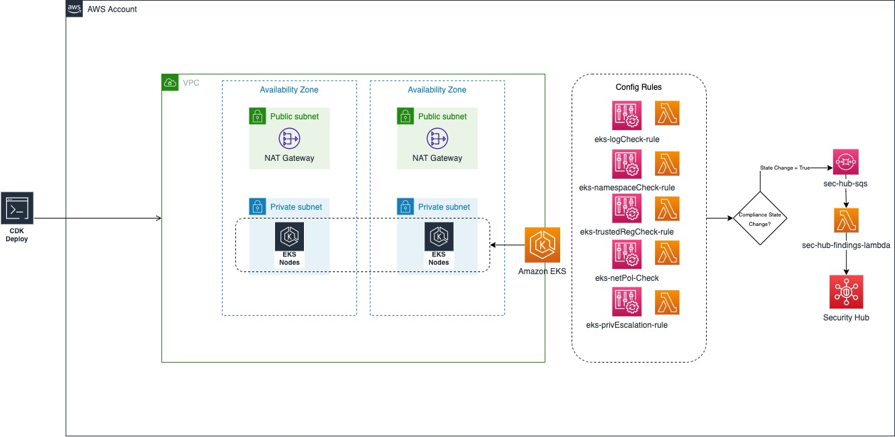

# Welcome to EKS Config rules with AWS CDK 

This project creates an EKS cluster using the AWS Cloud Development Kit (AWS CDK) and five AWS Config custom rules to detect EKS resources miconfigurations according to [Center for Internet Security (CIS) benchmark for Amazon Elastic Kubernetes Service (EKS)](https://aws.amazon.com/blogs/containers/introducing-cis-amazon-eks-benchmark/).

# Prerequisites

* Kubernetes Kubectl tool - https://kubernetes.io/docs/tasks/tools/.
* [AWS Command Line Interface](https://aws.amazon.com/cli/) (AWS CLI), installed and configured. (See Installing, updating, and uninstalling the AWS CLI in the AWS CLI documentation.)
* AWS CDK Toolkit, installed and configured. (See AWS CDK Toolkit in the [AWS CDK documentation](https://docs.aws.amazon.com/cdk/latest/guide/cli.html).)
* Node Package Manager (npm), installed and configured for the AWS CDK in Python. (See [Downloading and installing Node.js and npm in the npm documentation](https://docs.npmjs.com/downloading-and-installing-node-js-and-npm).)
* Python3 installed and configured. (See Python Setup and Usage in the [Python documentation](https://docs.python.org/3.5/using/index.html).)
* Pip3, installed and configured to install the Python requests library. (See the pip installation instructions on the [PyPl website](https://pypi.org/project/pip/).)
* An active [AWS account](https://portal.aws.amazon.com/billing/signup#/start).
* Sufficient AWS IAM permissions to deploy resources to an AWS account.
* [AWS Config should be enabled](https://docs.aws.amazon.com/config/latest/developerguide/gs-console.html) within the target region if the detective controls are desired.
* [AWS SecurityHub should be enabled](https://docs.aws.amazon.com/securityhub/latest/userguide/securityhub-settingup.html) in the target region.

# Product versions
* AWS CDK 2.8.0 or later.
* Node v16.13.0 or later.
* NPM Version 8.1.0 or later.
* Python 3.9

Resources: https://medium.com/geekculture/deploying-aws-lambda-layers-with-python-8b15e24bdad2 
https://www.infinitypp.com/amazon-aws/writing-custom-aws-config-rules-using-lambda/

The `cdk.json` file tells the CDK Toolkit how to execute your app.

This project is set up like a standard Python project.  The initialization
process also creates a virtualenv within this project, stored under the `.venv`
directory.  To create the virtualenv it assumes that there is a `python3`
(or `python` for Windows) executable in your path with access to the `venv`
package. If for any reason the automatic creation of the virtualenv fails,
you can create the virtualenv manually.

To manually create a virtualenv on MacOS and Linux:

```
$ python3 -m venv .venv
```

After the init process completes and the virtualenv is created, you can use the following
step to activate your virtualenv.

```
$ source .venv/bin/activate
```

If you are a Windows platform, you would activate the virtualenv like this:

```
% .venv\Scripts\activate.bat
```

Once the virtualenv is activated, you can install the required dependencies.

```
$ pip install -r requirements.txt
$ pip install -r layer-requirements.txt --target=resources/kubernetes_layer/python/lib/python3.9/site-packages
```
Modify the eks_admin_rolename variable in the app.py file to be the name of the Admin role in your AWS account, this is typically 'Admin'

At this point you can now synthesize the CloudFormation template for this code.

```
$ cdk synth
```
Bootstrap CDK into the target account.
```
$ cdk bootstrap 
```

To add additional dependencies, for example other CDK libraries, just add
them to your `setup.py` file and rerun the `pip install -r requirements.txt`
command.

## Useful commands

 * `cdk ls`          list all stacks in the app
 * `cdk synth`       emits the synthesized CloudFormation template
 * `cdk deploy`      deploy this stack to your default AWS account/region
 * `cdk diff`        compare deployed stack with current state
 * `cdk docs`        open CDK documentation

To deploy the resources:

```
cdk deploy --all
```
Once the resources are deployed we can connect to and interact with our cluster, the creation of the EKS stack 'eksconfigexample' provides an output to add the cluster credential token to your kubeconfig file. The Output is in the format stackname.environmentConfigCommand.

# What is Deployed?

We can see the following ConfigRules if we browse to Config > Rules in the Config Console
* `eks-logCheck-rule` Checks control plane logging is enabled for EKS cluster
* `eks-namespaceCheck-rule` Checks the default namespace to ensure no pods are deployed into this namesapce
* `eks-netPolCheck-rule` Checks that there is a network policy defined for each namespace in the cluster
* `eks-privEscalation-rule` Checks that there are no pods running containers with the AllowPrivilege Escalation flag
* `eks-trustedRegCheck-rule` Checks that container images are from trusted sources

# Architecture



# How do I add clusters for monitoring?
To add clusters for monitoring we need to ensure that clusters are listed in comma seperated manner to the 
eksconfigruleswithcdk/eks_cis_cdk/config_cis_cdk_stack.py

class lambdaStack(core.Stack):
    def __init__(
        self,
        scope: core.Construct,
        id: str,
        eks_lambda_role: _iam.Role,
        eks_cluster: eks.Cluster,
        **kwargs
    ) -> None:
        super().__init__(scope, id, **kwargs)
        target_clusters = eks_cluster
        trusted_registries = "602401143452.dkr.ecr.us-east-1.amazonaws.com,busybox"

From here we can modify the target clusters, we can also update the list of trusted container registries that we permit. In the provided example our target cluster is the sample cluster that we create with the CDK example, which is passed to the target_clusters variable as `eks_cluster`

# Examples
Examples are provided in the examples folder to bring the state of the rules that have currently been created into compliance. 

# Clearing up
To remove the resources created by CDK we can run 
```
$ cdk destroy --all
```
## Security

See [CONTRIBUTING](CONTRIBUTING.md#security-issue-notifications) for more information.

## License

This library is licensed under the MIT-0 License. See the LICENSE file.
